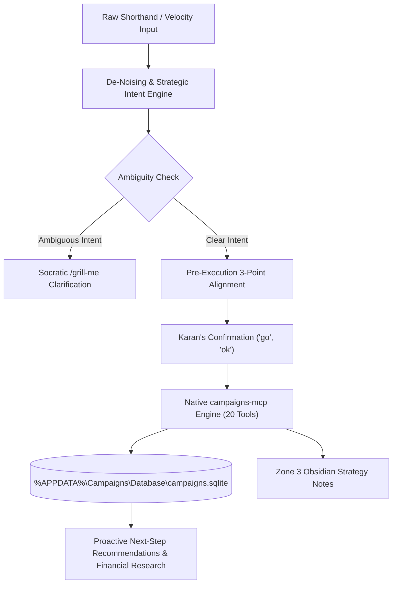

# ⚔️ Campaigns Command Center & Executive Directives

Use this skill whenever Karan invokes `/campaign` or manages tactical battles, daily strikes, financial obligations (`Treasury`), counterparties directory (`Counterparties`), long-term roadmaps, resource allocations, or strategic Obsidian battle intelligence.

> **Single Source of Truth**: This skill is the authoritative command center, cognitive bridge, schema governor, and strategic partner for the **Campaigns SQLite Database** (`%APPDATA%\Campaigns\Database\campaigns.sqlite`), powered by the open-source [`antigravity-campaigns-mcp`](https://github.com/karansinghverma979/antigravity-campaigns-mcp) server.

---

## 🏛️ Operating Philosophy & Core Directives

### 0. 🛑 STRICT MCP-ONLY ENGINE (Zero Ad-Hoc Scripts / Zero Direct DB Mutators)
* **ABSOLUTE BAN ON AD-HOC SCRIPTS**: The assistant is **strictly forbidden** from generating or executing ad-hoc Python scripts (`python -c ...`, `scratch/*.py`), PowerShell SQLite commands, or raw file mutators to interact with `campaigns.sqlite`.
* **MANDATORY MCP TOOL CALLS**: Every query, inspection, campaign mutation, strike dispatch, subtask update, counterparty transaction, treasury audit, and tag management operation **MUST** execute exclusively via the native `campaigns` MCP server using `call_mcp_tool`.
* **Standard Invocation Syntax**:
  ```javascript
  // Tool Call Signature:
  call_mcp_tool({
    ServerName: "campaigns",
    ToolName: "campaigns_<action>",
    Arguments: { ... }
  })
  ```
* **Tool Whitelist (20 Native Operations)**:
  - `campaigns_get_dashboard` ──► Daily situational briefing & strikes grouped by Minister.
  - `campaigns_audit_health` ──► 1-shot database integrity & drift diagnostic.
  - `campaigns_list_tasks` / `campaigns_get_task_details` ──► Query tasks & full relational trees.
  - `campaigns_create_task` / `campaigns_update_task` / `campaigns_delete_task` ──► Task lifecycle CRUD.
  - `campaigns_list_strikes` / `campaigns_create_strike` / `campaigns_update_strike` / `campaigns_delete_strike` ──► Strike directives CRUD.
  - `campaigns_manage_subtask` ──► Subtask checkpoints management (`created_at`).
  - `campaigns_manage_tag` ──► Taxonomy tags management.
  - `campaigns_get_treasury_dashboard` ──► 1-shot financial HUD (Payables/Receivables/Net Position/Overdue).
  - `campaigns_list_treasury` ──► Query & filter treasury obligations (`Payable`/`Receivable`, `Open`/`Settled`).
  - `campaigns_manage_treasury` ──► Obligation CRUD & partial payment recording (`record_payment`).
  - `campaigns_list_counterparties` ──► Counterparty directory with live calculated net balances.
  - `campaigns_get_counterparty_dossier` ──► 360° counterparty relationship profile & complete ledger.
  - `campaigns_manage_counterparty` ──► Counterparties CRUD management.
  - `campaigns_execute_sql` ──► Parameterized SQL for advanced read queries and multi-table analysis.

### 1. ⚡ Raw Velocity Intent Translation & De-Noising
* **Karan's Input Reality**: Karan operates at extreme velocity, inputting raw, unpolished, grammatically fragmented thoughts with frequent spelling variations and shorthand tokens.
* **The AI's Responsibility**:
  - **Zero Tone Distraction**: Never be reactive, pedantic, or distracted by unpolished text or typos.
  - **100% Core Intent Extraction**: Isolate the core technical, strategic, and tactical objective every single time.
  - **Auto-Normalization**: Convert fragmented ideas into clean, militaristic titles (`Battle Of <Name> <Year>`), standardized dates (`DD-MM-YYYY`), and canonical schema values.

### 2. 🪝 Pre-Execution 3-Point Confirmation Protocol
* **Mandatory Confirmation**: Before mutating, creating, updating, or deleting any task, subtask, strike, counterparty, treasury entry, or tag in the database, the assistant **MUST** present the 3-Point Alignment:
  1. **🎯 Target Scope**: Exact database tables (`Tasks`, `Strikes`, `Subtasks`, `Tags`, `Counterparties`, `Treasury`), records, or files touched.
  2. **🧠 Translated Objective**: Crystal-clear, distilled interpretation of Karan's goal.
  3. **⚡ Action Plan & Payload Preview**: Clean preview of proposed changes, dates, amounts, categories, and any operational risks/cons.
* **Fast Approval**: Upon Karan's confirmation (`yes`, `go`, `ok`, `proceed`, `prossed`), execute immediately via MCP tools without redundant back-and-forth.

### 3. 🥊 Ambiguity & The Socratic `/grill-me` Mandate
* **Zero Blind Guessing**: If a campaign scope, deadline, priority, flow type, amount, or Minister assignment is ambiguous, the assistant is **strictly forbidden from guessing**.
* **Instant Clarification**: Immediately trigger a sharp, concise `/grill-me` multi-choice interview with direct options to verify Karan's exact intent before writing.

### 4. 🚀 Continuous Proactive Momentum ("Always Propose Next Steps")
* **Never Stop at Passive Answers**: The assistant is an executive co-worker and proactive strategist.
* **Proactive Forward Drive**: After completing any operation, always provide:
  - Strategic insights and financial trade-offs.
  - Background research (exam phases, syllabus topics, motor winding schematics, tactical checklists).
  - Concrete, actionable next suggestions to keep operations moving forward at high velocity.

### 5. 🧠 Continuous Self-Improvement & Machine Learning
* New rules, preference shifts, and operational learnings discovered during campaigns must be updated in-place directly into `campaigns/SKILL.md` and `~/.gemini/memory/learnings.md`.

---

## 🏛️ System Architecture & Data Flow



---

## 👑 Pancha-Tattva Ministerial Alignment & Routing

The assistant must automatically recognize which Minister governs a specific task or strike:

| Minister | Domain & Governing Scope | Typical Tactical Tasks & Daily Strikes | Default |
| :--- | :--- | :--- | :---: |
| **`Adhipati`** | **Master Strategy & Operations** | Government exams (SSC, GDS, Railway, UPSC), official documents, high-stakes battles, core operational campaigns, treasury governance. | ⚔️ |
| **`Bhakta`** | **Craftsmanship, Devotion & Deep Mastery** | Motor winding engineering & rewinding diagrams, creative poster series (Mastery, 48 Laws), UI/UX design, technical craftsmanship. | 🛡️ *(Default)* |
| **`Antaryami`** | **Internal Psyche, Mind & Reflection** | Daily Journaling (`30RC00001`), self-reflection, meditation, mental fortress building, psychological audits. | 🧘 |
| **`Jigyasu`** | **Continuous Ingestion & Learning** | Reading Daily Law (`30RC00002`), books, philosophy, skill tutorials, technical documentation. | 📖 |
| **`Shava`** | **The Void / Memento Mori** | **STRICTLY NON-ASSIGNABLE**. Represents non-existence. Assignment throws a `Tactical Absolute` exception. | 🚫 *(Locked)* |

---

## 🏷️ Intelligent Tagging, Scheduling & Priority Strategy

* **Filesystem & Strategy Note Compatibility**:
  - Task titles directly map to strategy note filenames: `%USERPROFILE%\Obsidian\Adhipati\Campaigns\<Title>.md`.
  - **Strict Prohibition**: Task titles **must never contain** illegal Windows/Obsidian filename characters: `\ / : * ? " < > |` or control characters.
  - Any forbidden character in raw input is automatically sanitized by `sanitize_task_title` to guarantee zero filesystem collisions or broken markdown links.

* **Tagging Strategy**:
  - Government Exams / Jobs: `GOVT`, `RECRUITMENT`, `KARAN`, `EXAM`
  - Engineering & Practical Skills: `MOTOR_WINDING`, `PRACTICAL`, `WORKSHOP`, `SKILL`
  - Strategic Operations: `ADHIPATI`, `OPERATIONS`, `STRATEGY`
  - Software & Tooling: `TOOLING`, `AUTOMATION`, `DEV`

* **Scheduling Logic**:
  - `origin_date` / `opened_at`: Automatically set to today (`DD-MM-YYYY`).
  - `initiated_at`: Set when campaign moves to `Execution`.
  - `deadline` / `promise_date` / `expected_date`: Must always satisfy chronological invariants.

* **Priority Assignment**:
  - `High`: Time-sensitive exams, immediate debt dues, critical client deliverables.
  - `Medium`: Routine campaign milestones, regular monthly subscriptions (default).
  - `Low`: Background research, holding bay ideas, non-urgent receivables.

---

## ⚡ Native `campaigns-mcp` Toolset (20 Tools)

All database mutations and queries execute via native MCP tools for atomic, sub-millisecond transactions:

| Tool Name | Operation | Key Constraints & Invariants |
| :--- | :--- | :--- |
| `campaigns_audit_health` | Diagnostic Scanner | 1-shot audit: overdue campaigns, stale strikes, missing deadlines, orphan FKs across Tasks, Strikes, Subtasks, and Treasury. |
| `campaigns_get_dashboard` | Situational Briefing | Today's strikes grouped by Minister, active Execution campaigns, upcoming deadlines. |
| `campaigns_list_tasks` | Query Campaigns | Filter across `state`, `stage`, `priority`, `tag`, `search`. |
| `campaigns_get_task_details` | Relational Tree | Zero-hallucination tree: Task + Subtasks + Strikes + Tags. |
| `campaigns_create_task` | Create Campaign | Enforces `DD-MM-YYYY`, chronological ordering, mandatory deadline in Execution. |
| `campaigns_update_task` | Mutate Campaign | In-place update, auto-stamps, reschedule tracking. |
| `campaigns_delete_task` | Delete Campaign | Cascade removal of task, subtasks, tags, and strikes. |
| `campaigns_list_strikes` | Query Directives | Filter by `execution_date`, `assigned` Minister, `status`. |
| `campaigns_create_strike` | Add Directive | **Shava Guard**: Blocks Shava; defaults to `Bhakta`. Smart tokens `#Minister`, `@date`. |
| `campaigns_update_strike` | Update Directive | Modifies `status` (`NEUTRALIZED`), `assigned`, `notes`, `execution_date`, `reschedule_count`. |
| `campaigns_delete_strike` | Remove Directive | Deletes strike record. |
| `campaigns_manage_subtask` | Milestone CRUD | Actions: `create`, `update`, `delete`, `list`. Column `created_at`. |
| `campaigns_manage_tag` | Taxonomy CRUD | Actions: `add`, `remove`, `list_all`, `rename`. Standalone or task-linked. Strictly UPPERCASE. |
| `campaigns_get_treasury_dashboard`| Financial HUD | 1-shot summary metrics: Payables Due, Receivables Due, Net Position, Overdues. |
| `campaigns_list_treasury` | Query Obligations | Filter by `flow_type`, `state`, `category`, `counterparty_id`, `search`. |
| `campaigns_manage_treasury` | Treasury CRUD | Actions: `create`, `update`, `record_payment`, `delete`. Enforces 4-pillar columns. |
| `campaigns_list_counterparties` | Directory Search | Live computed net balances, total payable dues, total receivable dues. |
| `campaigns_get_counterparty_dossier`| 360° Profile | Deep profile + full chronological transactional ledger. |
| `campaigns_manage_counterparty` | Counterparty CRUD | Actions: `create`, `update`, `delete`. |
| `campaigns_execute_sql` | Power SQL Engine | Unrestricted read/write SQL queries for custom analytics with rollback safety. |

---

## 🗄️ MASTER 6-TABLE AUTHORITATIVE SQL SCHEMA BLUEPRINT

### 📌 Universal Schema Invariants & Design Rules
1. **Zero-Time Calendar Date Invariant (`DD-MM-YYYY`)**: All dates (`created_at`, `opened_at`, `closed_at`, `deadline`, `promise_date`, `expected_date`, `updated_at`) strictly store pure calendar dates in `DD-MM-YYYY` string format. Zero time, hours, minutes, seconds, or ISO timestamps.
2. **Strict Capitalized Case**: All status, state, priority, flow type, relation, and minister fields must strictly use Capitalized Case (First letter Capital, rest lowercase).
3. **Tags Dedicated UPPERCASE Standard**: `Tags.tag_name` strictly stores single-word UPPERCASE strings with underscores (e.g. `GOVT`, `MOTOR_WINDING`).
4. **Strict Closed Enums vs Extensible Open-Domain Fields**:
   - **Strict Closed Enums** (Invalid values are rejected): `Tasks.state`, `Tasks.stage`, `Tasks.priority`, `Subtasks.status`, `Strikes.status`, `Strikes.assigned`, `Treasury.state`, `Treasury.status`, `Treasury.flow_type`, `Treasury.priority`, `Counterparties.activity`.
   - **Extensible Open-Domain Fields** (Open to new user categories/titles in Capitalized Case): `Counterparties.name`, `Counterparties.relation`, `Treasury.title`, `Treasury.category`, `Treasury.opened_mode`, `Treasury.closed_mode`, `Tasks.title`, `Subtasks.title`, `Strikes.title`.
5. **Rich Multi-Line Markdown-Lite Support**: All multiline text/comment columns (`Tasks.end_note`, `Strikes.notes`, `Treasury.opened_note`, `Treasury.closed_note`, `Counterparties.comment`) render in the UI with built-in Markdown parsers. Use standard markdown: bullets (`- `, `* `), numbered lists (`1. `), headings (`#`, `##`), blockquotes (`>`), bold/italics, and divider lines (`---`).

---

### 1. 🏢 `Counterparties` (Directory & Trust Entity Layer)
```sql
CREATE TABLE IF NOT EXISTS Counterparties (
  id             INTEGER PRIMARY KEY AUTOINCREMENT,
  name           TEXT NOT NULL UNIQUE,              -- Extensible: "Zerodha", "SBI", "Rahul", "Mom", "Client X"
  relation       TEXT NOT NULL DEFAULT 'Personal',  -- Extensible: 'Personal', 'Friend', 'Family', 'Client', 'Vendor', 'Broker', 'Bank', 'Landlord', 'Other'
  activity       TEXT NOT NULL DEFAULT 'Active',    -- Strict Closed Enum: 'Active' | 'Dormant' | 'Banned' | 'Defaulted'
  contact        TEXT,                              -- Raw String: Mobile / Email / Handle / UPI ID
  comment        TEXT,                              -- Markdown-Lite: Specific rules, UPI IDs, remarks, terms, bank details
  created_at     TEXT NOT NULL,                     -- Strict DD-MM-YYYY (Zero time concept)
  updated_at     TEXT NOT NULL                      -- Strict DD-MM-YYYY (Zero time concept)
);
```

---

### 2. 💰 `Treasury` (Unified Symmetrical Financial Ledger)
```sql
CREATE TABLE IF NOT EXISTS Treasury (
  id                 INTEGER PRIMARY KEY AUTOINCREMENT,
  counterparty_id    INTEGER NOT NULL,                  -- Foreign Key -> Counterparties(id) ON DELETE CASCADE
  title              TEXT NOT NULL,                     -- Extensible: "Laptop EMI", "Dinner Split", "Client Retainer"
  flow_type          TEXT NOT NULL DEFAULT 'Payable',   -- Strict Closed Enum: 'Payable' (Outflow) | 'Receivable' (Inflow)
  category           TEXT NOT NULL DEFAULT 'Borrowed',  -- Extensible: 'Borrowed', 'Lent', 'Purchase', 'Investment', 'EMI', 'Service', 'Salary', 'Sip Investment', 'Service Bill', 'Advance Received', 'Money Lent', 'Client Invoice', 'Refund Pending', 'Reimbursement', 'Other'

  -- Financial Position
  amount             REAL NOT NULL,                     -- Total committed obligation in INR (> 0.0)
  paid_amount        REAL NOT NULL DEFAULT 0.0,         -- Cleared installment amount (0.0 to amount)
  priority           TEXT NOT NULL DEFAULT 'Medium',    -- Strict Closed Enum: 'High' | 'Medium' | 'Low'

  -- Lifecycle & State Machine
  state              TEXT NOT NULL DEFAULT 'Open',      -- Strict Closed Enum: 'Open' | 'Closed'
  status             TEXT NOT NULL DEFAULT 'In Progress',
  -- Under 'Open':   'In Progress' | 'Partially Paid' | 'Pending' | 'Disputed'
  -- Under 'Closed': 'Paid' (100% Cash) | 'Settled' (Barter/Haircut) | 'Defaulted' (Written-off)

  -- Symmetrical Opening Lifecycle
  opened_at          TEXT NOT NULL,                     -- Strict DD-MM-YYYY (Creation / handover date)
  opened_mode        TEXT NOT NULL DEFAULT 'UPI',       -- Extensible: 'UPI' | 'Cash' | 'NetBanking' | 'Card' | 'Barter' | 'Other'
  opened_reference   TEXT,                              -- Opening Bank UTR / Tx ID / Invoice # / Cheque #
  opened_note        TEXT,                              -- Markdown-Lite: Opening context, repayment terms, conditions

  -- Target Deadlines
  promise_date       TEXT,                              -- Hard committed return deadline (Strict DD-MM-YYYY)
  expected_date      TEXT,                              -- Soft realistic target forecast date (Strict DD-MM-YYYY)

  -- Symmetrical Closing Lifecycle
  closed_at          TEXT,                              -- Date finalized / settled (Strict DD-MM-YYYY)
  closed_mode        TEXT,                              -- Extensible: 'UPI' | 'Cash' | 'NetBanking' | 'Card' | 'Barter' | 'Other'
  closed_reference   TEXT,                              -- Closing settlement Bank UTR / Receipt / Tx ID
  closed_note        TEXT,                              -- Markdown-Lite: Settlement log, installment receipts, write-off reason

  -- Cross-System Grouping & Hook
  recurrence_id      TEXT DEFAULT NULL,                 -- UPPERCASE Group Tag (e.g. 'SIP-MONTHLY', 'RENT-2026')
  campaign_id        INTEGER DEFAULT NULL,              -- Optional Foreign Key -> Tasks(id) ON DELETE SET NULL

  updated_at         TEXT NOT NULL,                     -- Strict DD-MM-YYYY (Last modified date)

  FOREIGN KEY (counterparty_id) REFERENCES Counterparties(id) ON DELETE CASCADE,
  FOREIGN KEY (campaign_id) REFERENCES Tasks(id) ON DELETE SET NULL
);
```

---

### 3. 🎯 `Tasks` (Campaigns Master Ledger)
```sql
CREATE TABLE IF NOT EXISTS Tasks (
  id                    INTEGER PRIMARY KEY AUTOINCREMENT,
  title                 TEXT NOT NULL,                  -- Extensible: "Battle Of SSC CGL 2026" (Auto-sanitized: No \ / : * ? " < > |)
  origin_date           TEXT NOT NULL,                  -- Strict DD-MM-YYYY (Inception calendar date)
  modification_date     TEXT,                           -- Strict DD-MM-YYYY (Last updated date)
  priority              TEXT NOT NULL,                  -- Strict Closed Enum: 'High' | 'Medium' | 'Low'
  state                 TEXT NOT NULL,                  -- Strict Closed Enum: 'Arsenal' | 'Execution' | 'Breach' | 'Archive'
  stage                 TEXT NOT NULL,                  -- Strict Closed Enum:
                                                        -- Arsenal:   'RawIntel' | 'Strategizing'
                                                        -- Execution: 'Active' | 'Executing' (Requires deadline)
                                                        -- Breach:    'Overdue' | 'Breach'
                                                        -- Archive:   'Victory' | 'Aborted'
  deadline              TEXT,                           -- Strict DD-MM-YYYY (Mandatory in Execution, >= origin_date)
  initiated_at          TEXT,                           -- Strict DD-MM-YYYY (Stamped on Execution entry)
  reschedule_count      INTEGER DEFAULT 0,              -- Non-negative postponement counter
  reschedule_1          TEXT,                           -- Strict DD-MM-YYYY (1st rescheduled deadline snapshot)
  reschedule_2          TEXT,                           -- Strict DD-MM-YYYY (2nd rescheduled deadline snapshot)
  ended_date            TEXT,                           -- Strict DD-MM-YYYY (Stamped on Archive entry)
  end_note              TEXT,                           -- Markdown-Lite: Multi-line victory report / post-mortem analysis
  days_spent            INTEGER,                        -- Total calendar days from origin to ended_date
  is_breached_extracted INTEGER DEFAULT 0               -- Boolean: 0 | 1
);
```

---

### 4. ⚔️ `Strikes` (Daily Tactical Directives)
```sql
CREATE TABLE IF NOT EXISTS Strikes (
  id                 INTEGER PRIMARY KEY AUTOINCREMENT,
  title              TEXT NOT NULL,                     -- Extensible: "Revise Chapter 4 Winding Schematics"
  created_at         TEXT NOT NULL,                     -- Strict DD-MM-YYYY (Creation calendar date)
  execution_date     TEXT NOT NULL,                     -- Strict DD-MM-YYYY (or "" for Undated Holding Bay)
  assigned           TEXT DEFAULT 'Bhakta',             -- Strict Closed Enum: 'Adhipati' | 'Bhakta' | 'Antaryami' | 'Jigyasu' ('Shava' Locked)
  status             TEXT DEFAULT 'Standby',            -- Strict Closed Enum: 'Standby' | 'Engaged' | 'Neutralized' | 'Aborted' | 'Pending' | 'Template' | 'Undated'
                                                        -- Completion is strictly 'Neutralized' (never 'Completed' or 'Done')
  notes              TEXT,                              -- Markdown-Lite: Multi-line runbook bullets (- , 1. ), URLs, checklist
  task_id            INTEGER DEFAULT NULL,              -- Optional Foreign Key -> Tasks(id) ON DELETE CASCADE
  subtask_id         INTEGER DEFAULT NULL,              -- Optional Foreign Key -> Subtasks(id) ON DELETE CASCADE
  reschedule_count   INTEGER DEFAULT 0,                 -- Strike postponement counter
  recurrence_id      TEXT DEFAULT NULL,                 -- Habit / Fleet series ID (e.g. '30RC00001')
  FOREIGN KEY (task_id) REFERENCES Tasks(id) ON DELETE CASCADE,
  FOREIGN KEY (subtask_id) REFERENCES Subtasks(id) ON DELETE CASCADE
);
```

---

### 5. 📑 `Subtasks` (Tactical Checkpoints)
```sql
CREATE TABLE IF NOT EXISTS Subtasks (
  id             INTEGER PRIMARY KEY AUTOINCREMENT,
  task_id        INTEGER NOT NULL,                      -- Foreign Key -> Tasks(id) ON DELETE CASCADE
  title          TEXT NOT NULL,                         -- Extensible: "Draft Syllabus & Plan @18-09-2026"
  created_at     TEXT NOT NULL,                         -- Strict DD-MM-YYYY (Strictly created_at, NOT creation_time)
  status         TEXT NOT NULL,                         -- Strict Closed Enum: 'Initiated' | 'Doing' | 'Completed' | 'Failed'
  FOREIGN KEY (task_id) REFERENCES Tasks(id) ON DELETE CASCADE
);
```

---

### 6. 🏷️ `Tags` (Classification Taxonomy)
```sql
CREATE TABLE IF NOT EXISTS Tags (
  id             INTEGER PRIMARY KEY AUTOINCREMENT,
  task_id        INTEGER DEFAULT NULL,                  -- Nullable Foreign Key -> Tasks(id) ON DELETE CASCADE (Null = Standalone system tag)
  tag_name       TEXT NOT NULL,                         -- STRICTLY UPPERCASE single-word with underscores: 'GOVT', 'MOTOR_WINDING'
  FOREIGN KEY (task_id) REFERENCES Tasks(id) ON DELETE CASCADE
);
```

---

## 🔤 Raw Intent & Velocity Shorthand Normalizer Matrix

| User Shorthand / Raw Input | Canonical DB Column | Normalized Value | Handled By |
| :--- | :--- | :--- | :--- |
| `done`, `completed`, `finished`, `victory` (Strike) | `status` | **`NEUTRALIZED`** | `normalize_and_validate_strike_status` |
| `done`, `finished` (Subtask) | `status` | **`Completed`** | `normalize_and_validate_subtask_status` |
| `cancel`, `failed`, `aborted` | `status` | **`ABORTED`** / **`Failed`** | Schema Validators |
| `doing`, `active`, `progress` | `status` | **`ENGAGED`** / **`Doing`** | Schema Validators |
| `paid`, `settled`, `closed` (Treasury) | `state` / `status` | **`Settled`** | `normalize_and_validate_treasury_state` |
| `payable`, `due`, `debt`, `pay` | `flow_type` | **`Payable`** | `normalize_and_validate_flow_type` |
| `receivable`, `recv`, `incoming`, `lend` | `flow_type` | **`Receivable`** | `normalize_and_validate_flow_type` |
| `@today`, `@tod` | Date columns | Today (`DD-MM-YYYY`) | Smart Token Extractor |
| `@tomorrow`, `@tom`, `@tmrw` | Date columns | Tomorrow (`DD-MM-YYYY`) | Smart Token Extractor |
| `@overmorrow`, `@ovm` | Date columns | Day after tomorrow (`DD-MM-YYYY`) | Smart Token Extractor |
| `@+Nd` (e.g. `@+3d`) | Date columns | Today + $N$ days (`DD-MM-YYYY`) | Smart Token Extractor |
| `#High`, `#Medium`, `#Low`, `#med` | `priority` | Normalized Priority | Smart Token Extractor |
| `#Adhipati`, `#Bhakta`, `#Antaryami`, `#Jigyasu` | `assigned` | Minister Name | Smart Token Extractor |

---

## 🛡️ Obsidian Sentinel Boundary Protocol

When interacting with notes in `%USERPROFILE%\Obsidian\Adhipati\Campaigns\`:

```
┌────────────────────────────────────────────────────────┐
│ ❌ PORTION 1: YAML Frontmatter (Task Id, State, Meta) │ <-- IMMUTABLE (Managed by UI App)
├────────────────────────────────────────────────────────┤
│ ❌ PORTION 2: ## Tactical Subtasks (- [ ] Subtask ...)│ <-- IMMUTABLE (Synced by UI / DB)
├────────────────────────────────────────────────────────┤
│ <!-- @@CAMPAIGNS_NOTES_START@@ DO NOT EDIT OR REMOVE -->│
│ ✅ PORTION 3: ## Strategies & Operational Notes        │ <-- AI EDITABLE ZONE ONLY
│    (Live research, battle tactics, syllabus, links)    │
└────────────────────────────────────────────────────────┘
```

1. **Zero Note Creation**: The AI **never creates new `.md` files** in Obsidian. Notes are materialized exclusively by the UI application.
2. **Lookup by Task ID**: Always match target note files by scanning the first 2048 bytes of candidate files for `Task Id: <id>`. If missing on disk, report that the note is not yet materialized.
3. **Portion 3 Isolation**: Append or refine strategic research, battle plans, and syllabus links only below the `<!-- @@CAMPAIGNS_NOTES_START@@ -->` sentinel marker.

---

## 🎮 Invocation Modes & Command Suite

| Command / Trigger | Purpose | Operational Protocol |
| :--- | :--- | :--- |
| **`/campaign`** | Morning briefing / theater inspect. | Calls `campaigns_get_dashboard` to summarize today's strikes by Minister, active battles, and deadlines. |
| **`/campaign audit`** | Instant diagnostic scan. | Calls `campaigns_audit_health` to detect overdue tasks, stale strikes, missing deadlines, and broken FKs. |
| **`/campaign task [plan \| add \| close]`** | Campaign lifecycle management. | Plans or commits campaigns (`Battle Of ...`) with chronological timeline verification via `campaigns_create_task` / `campaigns_update_task`. |
| **`/campaign tag [add \| list \| rename]`** | Tag taxonomy management. | Manages uppercase categorization tags via `campaigns_manage_tag`. |
| **`/campaign subtask [add \| doing \| done \| fail]`** | Subtask milestone operations. | Updates tactical checkpoints and sets chronological dates via `campaigns_manage_subtask`. |
| **`/campaign strike [add \| undated \| deploy \| done]`** | Daily directive dispatch. | Inserts strikes (`STANDBY` / `UNDATED`), deploys holding bay strikes, marks completions (`NEUTRALIZED`) via `campaigns_create_strike` / `campaigns_update_strike`. |
| **`/campaign treasury [hud \| list \| add \| pay]`** | Financial ledger & obligations. | Inspects cash runway, lists payables/receivables, creates obligations, and records partial/full payments via `campaigns_get_treasury_dashboard`, `campaigns_list_treasury`, `campaigns_manage_treasury`. |
| **`/campaign counterparty [list \| dossier \| add]`** | Counterparty directory. | Inspects 360° dossiers, relationship balances, and manages counterparty entities via `campaigns_list_counterparties`, `campaigns_get_counterparty_dossier`, `campaigns_manage_counterparty`. |
| **`/campaign note <id> [intel]`** | Zone 3 Obsidian enrichment. | Locates note by Task ID and enriches Portion 3 below the sentinel marker. |
| **`/campaign rule [add \| audit \| sync]`** | Knowledge base governor. | Updates or audits rules, schemas, and learnings directly in `campaigns/SKILL.md`. |
