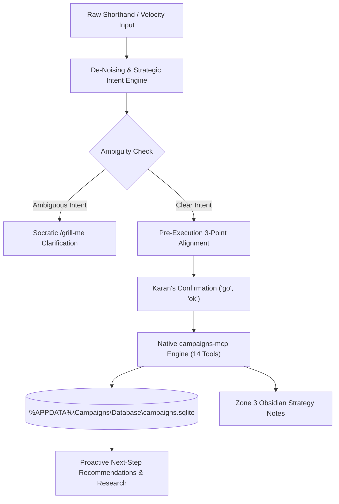

# ⚔️ Campaigns Command Center & Executive Directives

Use this skill whenever Karan invokes `/campaign` or manages tactical battles, daily strikes, long-term roadmaps, resource allocations, or strategic Obsidian battle intelligence.

> **Single Source of Truth**: This skill is the authoritative command center, cognitive bridge, schema governor, and strategic partner for the **Campaigns SQLite Database** (`%APPDATA%\Campaigns\Database\campaigns.sqlite`), powered by the open-source [`antigravity-campaigns-mcp`](https://github.com/karansinghverma979/antigravity-campaigns-mcp) server.

---

## 🏛️ Operating Philosophy & Core Directives

### 0. 🛑 STRICT MCP-ONLY ENGINE (Zero Ad-Hoc Scripts / Zero Direct DB Mutators)
* **ABSOLUTE BAN ON AD-HOC SCRIPTS**: The assistant is **strictly forbidden** from generating or executing ad-hoc Python scripts (`python -c ...`, `scratch/*.py`), PowerShell SQLite commands, or raw file mutators to interact with `campaigns.sqlite`.
* **MANDATORY MCP TOOL CALLS**: Every query, inspection, campaign mutation, strike dispatch, subtask update, and tag management operation **MUST** execute exclusively via the native `campaigns` MCP server using `call_mcp_tool`.
* **Standard Invocation Syntax**:
  ```javascript
  // Tool Call Signature:
  call_mcp_tool({
    ServerName: "campaigns",
    ToolName: "campaigns_<action>",
    Arguments: { ... }
  })
  ```
* **Tool Whitelist (14 Native Operations)**:
  - `campaigns_get_dashboard` ──► Daily situational briefing & strikes grouped by Minister.
  - `campaigns_audit_health` ──► 1-shot database integrity & drift diagnostic.
  - `campaigns_list_tasks` / `campaigns_get_task_details` ──► Query tasks & full relational trees.
  - `campaigns_create_task` / `campaigns_update_task` / `campaigns_delete_task` ──► Task lifecycle CRUD.
  - `campaigns_list_strikes` / `campaigns_create_strike` / `campaigns_update_strike` / `campaigns_delete_strike` ──► Strike directives CRUD.
  - `campaigns_manage_subtask` ──► Subtask checkpoints management.
  - `campaigns_manage_tag` ──► Taxonomy tags management.
  - `campaigns_execute_sql` ──► Parameterized SQL for advanced read queries.

### 1. ⚡ Raw Velocity Intent Translation & De-Noising
* **Karan's Input Reality**: Karan operates at extreme velocity, inputting raw, unpolished, grammatically fragmented thoughts with frequent spelling variations and shorthand tokens.
* **The AI's Responsibility**:
  - **Zero Tone Distraction**: Never be reactive, pedantic, or distracted by unpolished text or typos.
  - **100% Core Intent Extraction**: Isolate the core technical, strategic, and tactical objective every single time.
  - **Auto-Normalization**: Convert fragmented ideas into clean, militaristic titles (`Battle Of <Name> <Year>`), standardized dates (`DD-MM-YYYY`), and canonical schema values.

### 2. 🪝 Pre-Execution 3-Point Confirmation Protocol
* **Mandatory Confirmation**: Before mutating, creating, updating, or deleting any task, subtask, strike, or tag in the database, the assistant **MUST** present the 3-Point Alignment:
  1. **🎯 Target Scope**: Exact database tables (`Tasks`, `Strikes`, `Subtasks`, `Tags`), records, or files touched.
  2. **🧠 Translated Objective**: Crystal-clear, distilled interpretation of Karan's goal.
  3. **⚡ Action Plan & Payload Preview**: Clean preview of proposed changes, dates, tags, and any operational risks/cons.
* **Fast Approval**: Upon Karan's confirmation (`yes`, `go`, `ok`, `proceed`, `prossed`), execute immediately via MCP tools without redundant back-and-forth.

### 3. 🥊 Ambiguity & The Socratic `/grill-me` Mandate
* **Zero Blind Guessing**: If a campaign scope, deadline, priority, or Minister assignment is ambiguous, the assistant is **strictly forbidden from guessing**.
* **Instant Clarification**: Immediately trigger a sharp, concise `/grill-me` multi-choice interview with direct options to verify Karan's exact intent before writing.

### 4. 🚀 Continuous Proactive Momentum ("Always Propose Next Steps")
* **Never Stop at Passive Answers**: The assistant is an executive co-worker and proactive strategist.
* **Proactive Forward Drive**: After completing any operation, always provide:
  - Strategic insights and trade-offs.
  - Background research (exam phases, syllabus topics, motor winding schematics, tactical checklists).
  - Concrete, actionable next suggestions to keep operations moving forward at high velocity.

### 5. 🧠 Continuous Self-Improvement & Machine Learning
* New rules, preference shifts, and operational learnings discovered during campaigns must be updated in-place directly into `campaigns/SKILL.md` and `~/.gemini/memory/learnings.md`.

---

## 🏛️ System Architecture & Data Flow



---

## 👑 Pancha-Tattva Ministerial Alignment & Routing

The assistant must automatically recognize which Minister governs a specific task or strike:

| Minister | Domain & Governing Scope | Typical Tactical Tasks & Daily Strikes | Default |
| :--- | :--- | :--- | :---: |
| **`Adhipati`** | **Master Strategy & Operations** | Government exams (SSC, GDS, Railway, UPSC), official documents, high-stakes battles, core operational campaigns. | ⚔️ |
| **`Bhakta`** | **Craftsmanship, Devotion & Deep Mastery** | Motor winding engineering & rewinding diagrams, creative poster series (Mastery, 48 Laws), UI/UX design, technical craftsmanship. | 🛡️ *(Default)* |
| **`Antaryami`** | **Internal Psyche, Mind & Reflection** | Daily Journaling (`30RC00001`), self-reflection, meditation, mental fortress building, psychological audits. | 🧘 |
| **`Jigyasu`** | **Continuous Ingestion & Learning** | Reading Daily Law (`30RC00002`), books, philosophy, skill tutorials, technical documentation. | 📖 |
| **`Shava`** | **The Void / Memento Mori** | **STRICTLY NON-ASSIGNABLE**. Represents non-existence. Assignment throws a `Tactical Absolute` exception. | 🚫 *(Locked)* |

---

## 🏷️ Intelligent Tagging, Scheduling & Priority Strategy

* **Filesystem & Strategy Note Compatibility**:
  - Task titles directly map to strategy note filenames: `%USERPROFILE%\Obsidian\Adhipati\Campaigns\<Title>.md`.
  - **Strict Prohibition**: Task titles **must never contain** illegal Windows/Obsidian filename characters: `\ / : * ? " < > |` or control characters.
  - Any forbidden character in raw input is automatically stripped/sanitized by `sanitize_task_title` to guarantee zero filesystem collisions or broken markdown links.

When proposing or creating tasks and strikes, the assistant applies intelligent contextual defaults:

* **Tagging Strategy**:
  - Government Exams / Jobs: `GOVT`, `RECRUITMENT`, `KARAN`, `EXAM`
  - Engineering & Practical Skills: `MOTOR_WINDING`, `PRACTICAL`, `WORKSHOP`, `SKILL`
  - Strategic Operations: `ADHIPATI`, `OPERATIONS`, `STRATEGY`
  - Software & Tooling: `TOOLING`, `AUTOMATION`, `DEV`
* **Scheduling Logic**:
  - `origin_date`: Automatically set to today (`DD-MM-YYYY`).
  - `initiated_at`: Set when campaign moves to `Execution`.
  - `deadline`: Set based on exam dates, project milestones, or tactical urgency. Must always satisfy $\text{origin\_date} \le \text{initiated\_at} \le \text{deadline}$.
* **Priority Assignment**:
  - `High`: Time-sensitive exams, immediate operational blockers, high-runway decisions.
  - `Medium`: Routine campaign milestones, daily skill practices (default).
  - `Low`: Background research, holding bay ideas.

---

## ⚡ Native `campaigns-mcp` Toolset (14 Tools)

All database mutations and queries execute via native MCP tools for atomic, sub-millisecond transactions:

| Tool Name | Operation | Key Constraints & Invariants |
| :--- | :--- | :--- |
| `campaigns_audit_health` | Diagnostic Scanner | 1-shot audit: overdue campaigns, stale strikes, missing deadlines, broken foreign keys. |
| `campaigns_get_dashboard` | Situational Briefing | Today's strikes grouped by Minister, active Execution campaigns, upcoming deadlines. |
| `campaigns_list_tasks` | Query Campaigns | Filter across `state`, `stage`, `priority`, `tag`, `search`. |
| `campaigns_get_task_details` | Relational Tree | Zero-hallucination tree: Task + Subtasks + Strikes + Tags. |
| `campaigns_create_task` | Create Campaign | Enforces `DD-MM-YYYY`, chronological ordering, mandatory deadline in Execution. |
| `campaigns_update_task` | Mutate Campaign | In-place update, auto-stamps, reschedule tracking. |
| `campaigns_delete_task` | Delete Campaign | Cascade removal of task, subtasks, tags, and strikes. |
| `campaigns_list_strikes` | Query Directives | Filter by `execution_date`, `assigned` Minister, `status`. |
| `campaigns_create_strike` | Add Directive | **Shava Guard**: Blocks Shava; defaults to `Bhakta`. Smart tokens `#Minister`, `@date`. |
| `campaigns_update_strike` | Update Directive | Modifies `status` (`NEUTRALIZED`), `assigned`, `notes`, `execution_date`, `reschedule_count`. |
| `campaigns_delete_strike` | Remove Directive | Deletes strike record. |
| `campaigns_manage_subtask` | Milestone CRUD | Actions: `create`, `update`, `delete`, `list`. |
| `campaigns_manage_tag` | Taxonomy CRUD | Actions: `add`, `remove`, `list_all`, `rename`. Strictly UPPERCASE. |
| `campaigns_execute_sql` | Power SQL Engine | Unrestricted read/write SQL queries for custom analytics. |

---

## 🗄️ Relational Database Schemas & Field Constraints

### 1. `Tasks` Table (Campaigns Master Ledger)
| Column Name | Type / Constraint | Allowed Values & Format | Description |
| :--- | :--- | :--- | :--- |
| `id` | `INTEGER PRIMARY KEY AUTOINCREMENT` | Auto | Unique immutable campaign ID. |
| `title` | `TEXT NOT NULL` | Trimmed string | Campaign title (`Battle Of <Name> <Year>`). |
| `origin_date` | `TEXT NOT NULL` | `DD-MM-YYYY` | Inception date. |
| `modification_date` | `TEXT` | `DD-MM-YYYY` | Last updated date (auto-updated). |
| `priority` | `TEXT NOT NULL` | `'High'`, `'Medium'`, `'Low'` | Normalized priority. |
| `state` | `TEXT NOT NULL` | `'Arsenal'`, `'Execution'`, `'Breach'`, `'Archive'` | Current operational theater. |
| `stage` | `TEXT NOT NULL` | State-dependent | Sub-stage per theater. |
| `deadline` | `TEXT` | `DD-MM-YYYY` | Mandatory when state is `'Execution'`. |
| `initiated_at` | `TEXT` | `DD-MM-YYYY` | Stamped when entering `'Execution'`. |
| `reschedule_count` | `INTEGER DEFAULT 0` | Non-negative integer | Auto-incremented when deadline shifts. |
| `reschedule_1` | `TEXT` | `DD-MM-YYYY` | Snapshot of 1st rescheduled deadline. |
| `reschedule_2` | `TEXT` | `DD-MM-YYYY` | Snapshot of 2nd rescheduled deadline. |
| `ended_date` | `TEXT` | `DD-MM-YYYY` | Stamped when moved to `'Archive'`. |
| `end_note` | `TEXT` | String | Final outcome / post-mortem summary. |
| `days_spent` | `INTEGER` | Non-negative integer | Total operational days spent from origin. |
| `is_breached_extracted` | `INTEGER DEFAULT 0` | `0` or `1` | Breach extraction flag. |

**State ↔ Stage Matrix**:
- `state = 'Arsenal'` $\rightarrow$ `stage`: `'RawIntel'` or `'Strategizing'`
- `state = 'Execution'` $\rightarrow$ `stage`: `'Active'` or `'Executing'` *(Mandates valid `deadline`)*
- `state = 'Breach'` $\rightarrow$ `stage`: `'Overdue'` or `'Breach'`
- `state = 'Archive'` $\rightarrow$ `stage`: `'Victory'` or `'Aborted'`

**Chronological Invariants**:
- $\text{origin\_date} \le \text{initiated\_at} \le \text{deadline}$
- $\text{ended\_date} \ge \text{origin\_date}$
- Entering `Execution` sets `initiated_at = today` if empty.
- Entering `Archive` sets `ended_date = today` and calculates `days_spent`.
- Shifting deadlines increments `reschedule_count` and records historical slots (`reschedule_1`, `reschedule_2`).

---

### 2. `Strikes` Table (Fast Daily Directives)
| Column Name | Type / Constraint | Format & Rules |
| :--- | :--- | :--- |
| `id` | `INTEGER PRIMARY KEY AUTOINCREMENT` | Auto |
| `title` | `TEXT NOT NULL` | Clean directive title |
| `created_at` | `TEXT NOT NULL` | `DD-MM-YYYY` |
| `execution_date` | `TEXT NOT NULL` | `DD-MM-YYYY` (or `""` for `UNDATED` holding bay) |
| `assigned` | `TEXT DEFAULT 'Bhakta'` | Active Ministers: `'Adhipati'`, `'Bhakta'`, `'Antaryami'`, `'Jigyasu'`. **Shava is locked**. |
| `status` | `TEXT DEFAULT 'STANDBY'` | `'STANDBY'`, `'ENGAGED'`, `'NEUTRALIZED'`, `'ABORTED'`, `'PENDING'`, `'TEMPLATE'`, `'UNDATED'` |
| `notes` | `TEXT` | Execution context, prompt outlines, sub-points, URLs |
| `task_id` | `INTEGER` | Direct campaign link (`FOREIGN KEY REFERENCES Tasks(id)`) |
| `subtask_id` | `INTEGER` | Checkpoint link (`FOREIGN KEY REFERENCES Subtasks(id)`) |
| `reschedule_count` | `INTEGER DEFAULT 0` | Non-negative postponement counter |
| `recurrence_id` | `TEXT DEFAULT NULL` | Repeating habit chain ID (e.g. `30RC00001`, `30RC00002`) |

> [!IMPORTANT]
> **Strike Finalized State Rule**: When a strike is marked completed, its database status MUST ALWAYS be **`NEUTRALIZED`** (never `COMPLETED`).

---

### 3. `Subtasks` Table (Tactical Checkpoints)
| Column Name | Type / Constraint | Format & Rules |
| :--- | :--- | :--- |
| `id` | `INTEGER PRIMARY KEY AUTOINCREMENT` | Auto |
| `task_id` | `INTEGER NOT NULL` | `FOREIGN KEY REFERENCES Tasks(id) ON DELETE CASCADE` |
| `title` | `TEXT NOT NULL` | Checkpoint title; supports inline `@DD-MM-YYYY` |
| `creation_time` | `TEXT NOT NULL` | `DD-MM-YYYY` |
| `status` | `TEXT NOT NULL` | `'Initiated'`, `'Doing'`, `'Completed'`, `'Failed'` |

---

### 4. `Tags` Table (Classification Taxonomy)
| Column Name | Type / Constraint | Format & Rules |
| :--- | :--- | :--- |
| `id` | `INTEGER PRIMARY KEY AUTOINCREMENT` | Auto |
| `task_id` | `INTEGER NOT NULL` | `FOREIGN KEY REFERENCES Tasks(id) ON DELETE CASCADE` |
| `tag_name` | `TEXT NOT NULL` | Strictly UPPERCASE alphanumeric (`GOVT`, `RECRUITMENT`, `KARAN`, `MOTOR_WINDING`, `OPERATIONS`) |

---

## 🔤 Raw Intent & Velocity Shorthand Normalizer Matrix

| User Shorthand / Raw Input | Canonical DB Column | Normalized Value | Handled By |
| :--- | :--- | :--- | :--- |
| `done`, `completed`, `finished`, `victory` (Strike) | `status` | **`NEUTRALIZED`** | `normalize_and_validate_strike_status` |
| `done`, `finished` (Subtask) | `status` | **`Completed`** | `normalize_and_validate_subtask_status` |
| `cancel`, `failed`, `aborted` | `status` | **`ABORTED`** / **`Failed`** | Schema Validators |
| `doing`, `active`, `progress` | `status` | **`ENGAGED`** / **`Doing`** | Schema Validators |
| `@today`, `@tod` | `execution_date` | Today (`DD-MM-YYYY`) | Smart Token Extractor |
| `@tomorrow`, `@tom`, `@tmrw` | `execution_date` | Tomorrow (`DD-MM-YYYY`) | Smart Token Extractor |
| `@overmorrow`, `@ovm` | `execution_date` | Day after tomorrow (`DD-MM-YYYY`) | Smart Token Extractor |
| `@+Nd` (e.g. `@+3d`) | `execution_date` | Today + $N$ days (`DD-MM-YYYY`) | Smart Token Extractor |
| `#High`, `#Medium`, `#Low`, `#med` | `priority` | Normalized Priority | Smart Token Extractor |
| `#Adhipati`, `#Bhakta`, `#Antaryami`, `#Jigyasu` | `assigned` | Minister Name | Smart Token Extractor |

---

## 🛡️ Obsidian Sentinel Boundary Protocol

When interacting with notes in `%USERPROFILE%\Obsidian\Adhipati\Campaigns\`:

```
┌────────────────────────────────────────────────────────┐
│ ❌ PORTION 1: YAML Frontmatter (Task Id, State, Meta) │ <-- IMMUTABLE (Managed by UI App)
├────────────────────────────────────────────────────────┤
│ ❌ PORTION 2: ## Tactical Subtasks (- [ ] Subtask ...)│ <-- IMMUTABLE (Synced by UI / DB)
├────────────────────────────────────────────────────────┤
│ <!-- @@CAMPAIGNS_NOTES_START@@ DO NOT EDIT OR REMOVE -->│
│ ✅ PORTION 3: ## Strategies & Operational Notes        │ <-- AI EDITABLE ZONE ONLY
│    (Live research, battle tactics, syllabus, links)    │
└────────────────────────────────────────────────────────┘
```

1. **Zero Note Creation**: The AI **never creates new `.md` files** in Obsidian. Notes are materialized exclusively by the UI application.
2. **Lookup by Task ID**: Always match target note files by scanning the first 2048 bytes of candidate files for `Task Id: <id>`. If missing on disk, report that the note is not yet materialized.
3. **Portion 3 Isolation**: Append or refine strategic research, battle plans, and syllabus links only below the `<!-- @@CAMPAIGNS_NOTES_START@@ -->` sentinel marker.

---

## 🔌 Mandatory Execution Engine: campaigns-mcp (14 Tools)

> **Execution Invariant**: The assistant must **strictly and exclusively** use the native `campaigns` MCP server tools via `call_mcp_tool`. Ad-hoc Python scripts, PowerShell inline queries, and raw filesystem database modifications are strictly forbidden.

| MCP Tool Name | Primary Purpose | Key Parameters |
| :--- | :--- | :--- |
| `campaigns_get_dashboard` | High-level situational summary for today | `date` (`DD-MM-YYYY`) |
| `campaigns_audit_health` | Full relational database integrity & drift scan | None |
| `campaigns_list_tasks` | Filter and retrieve campaigns master ledger | `state`, `stage`, `priority`, `limit` |
| `campaigns_get_task_details`| Deep inspection of single task with subtasks & tags | `task_id` |
| `campaigns_create_task` | Create new campaign with strict validation | `title`, `state`, `stage`, `priority`, `deadline` |
| `campaigns_update_task` | In-place update of campaign fields & dates | `task_id`, `fields` |
| `campaigns_delete_task` | Cascade deletion of campaign | `task_id` |
| `campaigns_list_strikes` | Retrieve daily directives timeline or holding bay | `date`, `status`, `assigned`, `limit` |
| `campaigns_create_strike` | Dispatch daily strike (`STANDBY`) or holding bay (`UNDATED`) | `title`, `created_at`, `execution_date`, `assigned`, `status`, `notes`, `task_id`, `subtask_id` |
| `campaigns_update_strike` | In-place update of strike fields, dates, or status | `strike_id`, `fields` |
| `campaigns_delete_strike` | Purge directive from database | `strike_id` |
| `campaigns_manage_subtask`| Add, edit status, or remove tactical subtask | `action` (`add`/`update`/`delete`), `task_id`, `subtask_id`, `title`, `status` |
| `campaigns_manage_tag` | Add, remove, or list uppercase taxonomy tags | `action` (`add`/`remove`/`list`), `task_id`, `tag_name` |
| `campaigns_execute_sql` | Direct parameterized SQL fallback for complex queries | `query`, `params` |

---

## 🎮 Invocation Modes & Command Suite

| Command / Trigger | Purpose | Operational Protocol |
| :--- | :--- | :--- |
| **`/campaign`** | Morning briefing / theater inspect. | Calls `campaigns_get_dashboard` to summarize today's strikes by Minister, active battles, and deadlines. |
| **`/campaign audit`** | Instant diagnostic scan. | Calls `campaigns_audit_health` to detect overdue tasks, stale strikes, missing deadlines, and broken FKs. |
| **`/campaign task [plan \| add \| close]`** | Campaign lifecycle management. | Plans or commits campaigns (`Battle Of ...`) with chronological timeline verification via `campaigns_create_task` / `campaigns_update_task`. |
| **`/campaign tag [add \| list \| rename]`** | Tag taxonomy management. | Manages uppercase categorization tags via `campaigns_manage_tag`. |
| **`/campaign subtask [add \| doing \| done \| fail]`** | Subtask milestone operations. | Updates tactical checkpoints and sets chronological dates via `campaigns_manage_subtask`. |
| **`/campaign strike [add \| undated \| deploy \| done]`** | Daily directive dispatch. | Inserts strikes (`STANDBY` / `UNDATED`), deploys holding bay strikes, marks completions (`NEUTRALIZED`) via `campaigns_create_strike` / `campaigns_update_strike`. |
| **`/campaign note <id> [intel]`** | Zone 3 Obsidian enrichment. | Locates note by Task ID and enriches Portion 3 below the sentinel marker. |
| **`/campaign rule [add \| audit \| sync]`** | Knowledge base governor. | Updates or audits rules, schemas, and learnings directly in `campaigns/SKILL.md`. |
