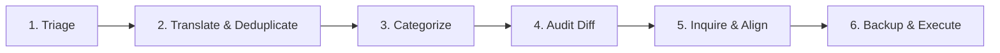
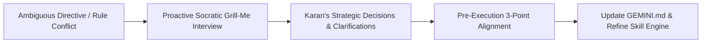

# 🌌 Gemini Permanent Memory & Directives Skill

Use this skill to inspect, audit, add, or modify permanent instructions, mental architecture, and operating protocols in `~/.gemini/GEMINI.md`.

---

## 🎮 Invocation Modes

| Mode / Command | Trigger & Purpose | Protocol |
| :--- | :--- | :--- |
| **Inspect / Query** | `/gemini`, *"What are my rules for X?"* | Direct, read-only factual response. Zero edits proposed. |
| **Mutate / Add** | `/gemini add ...`, *"Update directive..."* | Triggers the **6-Stage Lifecycle Pipeline**. |
| **Audit & Prune** | `/gemini audit` | Scans for dead paths, phrasing drift, and compaction opportunities. |
| **Rollback** | `/gemini rollback` | Restores `~/.gemini/GEMINI.md` from `~/.gemini/GEMINI.md.bak`. |

---

## 🏛️ Memory Management Lifecycle

Every modification to `~/.gemini/GEMINI.md` must strictly follow this 6-stage operational pipeline:

---

## 📋 Operational Directives

### 1. 🔍 Knowledge Triage (Ephemeral vs. Permanent)
- **Filtration**: Explicitly filter out transient task details, session-specific debugging, and temporary context.
- **Admissibility**: Only persistent executive directives, mental architecture rules, database schemas, and global workflow protocols are permitted into `GEMINI.md`.
- **Reroute Non-Permanent Data**:
  - Personal background / bio metrics $\rightarrow$ `~/.gemini/Profile.md` (via `/profile`)
  - Tactical tasks & daily strikes $\rightarrow$ SQLite via `/campaign strike`
  - Dynamic project state & learnings $\rightarrow$ `~/.gemini/memory/`

### 2. 🎯 Intent Translation & Authoritative Tone
- **Translate Raw Intent**: Convert fast, informal conversational thoughts into sharp, structured, and professional executive statements while preserving 100% of core intent.
- **Authoritative Tone**: Write strictly in 2nd/3rd-person executive phrasing (*"The assistant must..."*, *"You are..."*, *"Never..."*).
- **Conciseness**: Zero conversational filler or markdown fluff inside `GEMINI.md`. Keep every line factual and directly actionable.

### 3. 🛡️ Deduplication & Conflict Prevention
- **Audit Prior to Mutation**: Inspect existing entries before drafting changes.
- **Prevent Duplication**: Never insert parallel or redundant rules.
- **Resolve Collisions**: If new intent modifies or contradicts older directives, explicitly update/merge the existing entry rather than appending conflicting statements.

### 4. 🗂️ Categorization & Taxonomy (Zero Bottom-Dumping)
- **Structural Placement**: Every directive must be placed in its exact logical category. Never blindly append rules to the bottom of the file.
- **Standard Taxonomy**:
  1. `🪝 Mandatory Pre-Execution Intent Verification Hook`
  2. `👤 User Profile & Mental Architecture (Pancha-Tattva)`
  3. `📂 Core System Locations & Schemas`
  4. `⚡ Execution Directives & Operational Modes`
- **Category Creation**: If a directive requires a new category, explicitly propose creating the named section during the Pre-Execution Audit.

### 5. 🪝 Pre-Mutation Audit Summary (Verification Hook)
Before modifying `~/.gemini/GEMINI.md`, present a clear 4-part breakdown:
- **Previous State**: The existing relevant section or text block.
- **Raw User Intent**: What the user requested.
- **Proposed Delta**: Exactly what is being added, updated, or removed (and rationale).
- **Final State Preview**: The exact formatted markdown block as it will appear in the file.
- **Clarification**: If intent is ambiguous or missing parameters, ask the user before writing.

### 6. 💾 Backup, Auto-Initialization & Strict Formatting Execution
- **Auto-Initialization**: If `~/.gemini/GEMINI.md` does not exist, automatically create and initialize the file cleanly.
- **Rollback Safety**: Before writing or modifying an existing `~/.gemini/GEMINI.md`, always create/update `~/.gemini/GEMINI.md.bak`.
- **Formatting Standards**:
  - Strictly UTF-8 encoded.
  - Standard, clean GitHub Flavored Markdown.
  - Consistent indentation and clean list hierarchy.

---

## 🔁 Self-Improvement & Socratic `/grill-me` Alignment Loop

1. **Active Socratic Interviewing (`/grill-me`)**:
   - Whenever an executive instruction or rule structure is ambiguous or lacks parameters, the AI immediately initiates a concise Socratic inquiry to clarify intent instead of making assumptions.
2. **Continuous Directive Evolution**:
   - Persists crystallized learnings and new operational standards across conversations.

---

## 🧹 Memory Compaction & Audit Routine (`/gemini audit`)

When `/gemini audit` is triggered:
1. **Health Scan**:
   - Verify all file paths and database locations exist on disk.
   - Detect redundant, overlapping, or obsolete rules.
   - Check frontmatter and Markdown syntax formatting.
2. **Health Report**: Present findings (verified rules, broken paths, pruning opportunities).
3. **Compaction Proposal**: Present a Pre-Mutation Audit Diff for user confirmation before applying any compaction.

