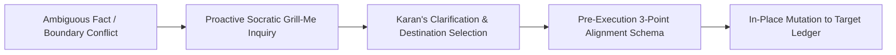

# 📡 Situational Intelligence & Current Reality Skill

Use this skill whenever Karan invokes `/intel` or shares dynamic, rolling life updates—such as changing courses, leaving/joining jobs, updating living arrangements, daily commuting setups, or shifting active lifestyle routines.

> **Single Source of Truth**: This skill is the authoritative operational governor and schema specification for **Karan's Situational Intelligence Ledger** (`~/.gemini/Intel.md`).

---

## 🏛️ The Separation of Concerns Taxonomy

```mermaid
flowchart TD
    subgraph Mindset ["🤖 AI Rules & Directives"]
        G["`~/.gemini/GEMINI.md`<br><b>/gemini</b>: AI rules, tone, alignment"]
    end

    subgraph UserKnowledge ["👤 Karan's Knowledge Layers"]
        P["`~/.gemini/Profile.md`<br><b>/profile</b>: IMMUTABLE BASELINE (Name, DOB, Marks)"]
        I["`~/.gemini/Intel.md`<br><b>/intel</b>: DYNAMIC CURRENT REALITY (Courses, Jobs, Living Setup)"]
        C["`campaigns.sqlite`<br><b>/campaign</b>: TACTICAL EXECUTION (Strikes, Tasks, Economy)"]
        O["`%USERPROFILE%\Obsidian\`<br><b>/obsidian & /reflection</b>: SECOND BRAIN (Pancha-Tattva)"]
    end
```

### 🔍 Strict Boundary Rules: `Profile.md` vs. `Intel.md`

| Attribute | `~/.gemini/Profile.md` (`/profile`) | `~/.gemini/Intel.md` (`/intel`) |
| :--- | :--- | :--- |
| **Data Nature** | **Permanent & Immutable** | **Dynamic & Rolling Reality** |
| **Scope** | Full Name, DOB (18-08-2005), 10th/12th Marks, Height. | Active course (Motor Winding), Job state (Left Technotask), Hostel room, Active daily habits. |
| **Update Velocity** | Rare (only on permanent milestone completion). | Frequent / Living (updated as life evolves). |
| **State Mutation** | Static historical records. | **In-Place Mutation** (Active focus updated; prior roles moved to Past Ledger). |

---

## 🔄 Dynamic In-Place Mutation & State Transitions

When a life update occurs, never blindly append duplicate lines:

1. **Active Focus Mutation**: Update Section 2 (*Active Vocations, Courses & Engagements*) in-place.
2. **Clean State Archival**: If an engagement ended (e.g. resigning from Technotask, concluding a course), move it cleanly to Section 3 (*Past Engagements Ledger*) with the exact transition reason and date.
3. **Zero Active Conflicts**: Ensure the active focus section strictly reflects the single ground truth of today.

---

## 📑 `~/.gemini/Intel.md` Master Ledger Schema

All entries in `~/.gemini/Intel.md` must strictly conform to these 5 sections:

```markdown
# 📡 Situational Intelligence & Current Reality: Karan Singh Verma

## 📍 1. Current Living & Physical Setup
- Current Base, room context, daily commute & physical environment.

## 💼 2. Active Vocations, Courses & Engagements
- Active technical training (e.g. Motor Winding), academic semester focus, active system builds.

## 🛑 3. Past Engagements Ledger (Clean Historical State)
- Table: Role / Course | Organization | Period | Final Status | Transition Reason

## ⚙️ 4. Active Tooling & Daily Workstation Context
- Primary PC (Motobook), Mobile device (Blaze), network SSID & IP topology, active shell prompts.

## 🎯 5. Immediate 30–90 Day Operational Horizon
- Core technical focus, PST conditioning goals, active cognitive reviews.
```

---

## 🎮 Invocation Modes & Command Suite

| Command / Trigger | Purpose & Lens | Operational Protocol |
| :--- | :--- | :--- |
| **`/intel` / `/intel status`** | Current reality radar. | Reads and presents active living setup, current courses, and daily workstation telemetry from `Intel.md`. |
| **`/intel update course <name>`** | In-place course update. | Updates active vocational/technical training in Section 2. |
| **`/intel archive <role> <reason>`**| Safe state transition. | Moves completed or abandoned engagement from Section 2 to Section 3 (Past Ledger) with reason. |
| **`/intel living <details>`** | Living setup update. | Updates hostel, room, or daily commute telemetry in Section 1. |
| **`/intel audit`** | Reality & stale fact scan. | Checks for outdated courses, completed milestones, or conflicting statements against SQLite campaigns. |
| **`/intel rollback`** | Safe snapshot restore. | Restores `~/.gemini/Intel.md` from `~/.gemini/Intel.md.bak`. |

---

## 🔁 Multi-Loop Alignment & Socratic `/grill-me` Protocol



### 1. The Ambiguity Socratic Grill-Me Mandate
- If the assistant is unsure whether an incoming fact belongs in `Profile.md`, `Intel.md`, `campaigns.sqlite`, `GEMINI.md`, or `Obsidian/`:
  - **The assistant is strictly forbidden from guessing.**
  - Immediately trigger a concise `/grill-me` question with clear options.

### 2. The Learning & Self-Evolution Loop
- When new device IP ranges, living locations, or workstation tools are configured:
  - Automatically update `Intel.md` Section 4 (*Active Tooling*).
  - Sync technical networking gotchas into `~/.gemini/memory/learnings.md`.

---

## 🪝 Pre-Execution 3-Point Alignment Schema

*Mandatory before modifying `~/.gemini/Intel.md`:*

1. **🎯 Target Scope**: `~/.gemini/Intel.md` (and backup `~/.gemini/Intel.md.bak`).
2. **🧠 Translated Objective**: Crisp summary of the situational reality update.
3. **⚡ Proposed Payload Preview & Risk Warnings**:
   - Exact Markdown diff (In-place update vs. Past Ledger archival).
   - Confirmation that permanent `Profile.md` remains pristine.