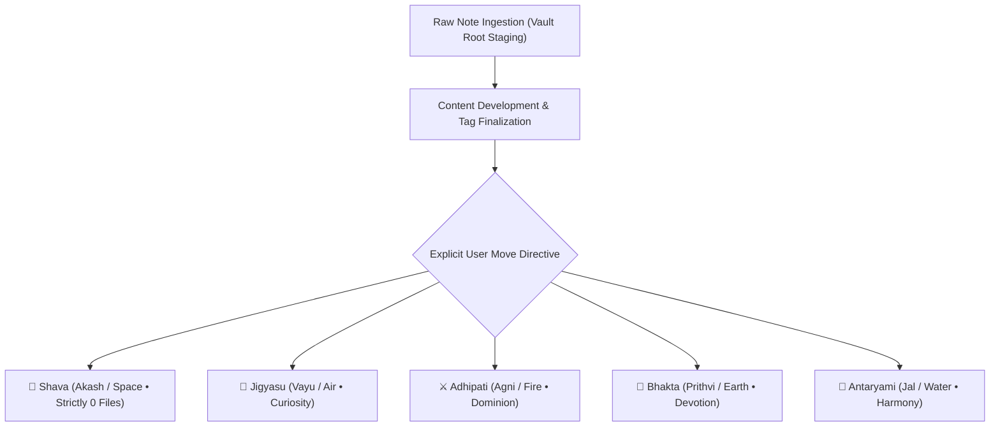
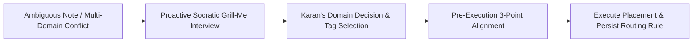

# 🧠 Obsidian Second Brain Vault Skill

Use this skill whenever Karan invokes `/obsidian` or requests note organization, classification, frontmatter auditing, tag standardization, or knowledge synthesis inside his **Second Brain Vault** (`%USERPROFILE%\Obsidian`).

> **Architectural Authority**: Grounded in the **Official Decree: The Psychological Constitution of Karan Singh Verma** (`Antaryami/Disclosures/OFFICIAL DECREE THE PSYCHOLOGICAL CONSTITUTION OF KARAN SINGH VERMA.md`). Every note is an extension of Karan's mind and must be kept pristine, structured, and organized at all times.

---

## 🏛️ The Pancha-Tattva 5-Domain Architecture

Every permanent note in the vault lives strictly inside one of the 5 foundational elemental domains:



---

## 📥 Default Ingestion & Root-First Creation Protocol

Karan enforces a strict two-phase staging workflow for all new notes:

1. **Default Root Staging Mandate**:
   - When creating ANY new note (`.md` or any file) requested by Karan, **the assistant must ALWAYS create it directly in the Root folder of the vault (`%USERPROFILE%\Obsidian\<FileName>.md`)**.
   - **Zero Premature Placement**: Never create new files directly inside domain subfolders (`Jigyasu/`, `Adhipati/`, `Bhakta/`, `Antaryami/`) by default.
2. **Refinement & Tag Finalization Phase**:
   - The note stays in the Root staging area while drafting, iterating, refining structure, and finalizing tags with Karan.
3. **Explicit Move Gate**:
   - A note is moved from Root into a domain folder **ONLY** when Karan explicitly executes the move or gives a direct instruction to move it.

---

### 1. 🌌 `Shava/` (The Core • Akash / Space • Shunya / Void)
- **Archetype**: The Corpse / The Void / No-Mind / Non-Existence.
- **Drive (Shakti)**: **Shunya** (The absolute void, empty space, stillness, "Do Nothing").
- **Immutable Rule (Shunya-Sthiti Protocol)**:
  - `Shava/` exists purely as the metaphysical and architectural anchor for the Void (Shunya).
  - **Zero Content Mandate**: The system and assistant must **NEVER create any file or subfolder inside `Shava/`**. It remains eternally empty by design.
- **Target Folder**: `Shava/` (Strictly empty at all times).

### 2. 🔬 `Jigyasu/` (The Child • Vayu / Air • Curiosity)
- **Archetype**: The Student / The Seeker / The Scholar.
- **Drive (Shakti)**: **Jigyasa** (Curiosity, the input fuel that feeds Adhipati's fire).
- **Scope**: Mechanical Engineering Diploma (SEM notes, textbooks), Cybernetics, Linux architecture, Neovim configs, programming, raw research, Socratic AI dialogues on concepts.
- **Target Folders**: `Jigyasu/Dialogues/`, `Jigyasu/Lyrics/`, `Jigyasu/Mentor/`, `Jigyasu/Diploma/`, `Jigyasu/Study/`.

### 3. ⚔️ `Adhipati/` (The Mature • Agni / Fire • Dominion)
- **Archetype**: The Supreme Commander / The Sovereign Strategist.
- **Drive (Shakti)**: **Adhipatya** (Dominion, empire-building, order, ruthless effectiveness).
- **Scope**: Career conquests, Defense & Govt recruitments, strategic roadmaps, tactical operations.
- **Target Folders**: `Adhipati/Campaigns/` *(Automated Sentinel Governed)*, `Adhipati/Career/`, `Adhipati/Strategy/`.

### 4. 🏃 `Bhakta/` (The Adult • Prithvi / Earth • Devotion & Labor)
- **Archetype**: The Loyal Soldier / The Hard Worker / Samurai.
- **Drive (Shakti)**: **Bhakti** (Surrender to daily routine, physical structure that grounds the restless air).
- **Scope**: Physical PST/PET conditioning, 1.6km/5km run metrics, gym workouts, physical stamina, daily routines, habit trackers.
- **Target Folders**: `Bhakta/Fitness/`, `Bhakta/Routines/`, `Bhakta/PhysicalPST/`.

### 5. 🧘 `Antaryami/` (The Guardian • Jal / Water • Harmony & Review)
- **Archetype**: The Inner Controller / The Watchman.
- **Drive (Shakti)**: **Samanvaya** (Harmony, cooling the fire, the mirror that reviews the day).
- **Scope**: Evening review journals, psychological constitution disclosures, self-audits, core decrees, emotional hygiene.
- **Target Folders**: `Antaryami/Reflections/`, `Antaryami/Dialogues/`, `Antaryami/Decrees/`, `Antaryami/Journals/`.

---

## 🏷️ Properties (YAML Frontmatter) & Tag Taxonomy Standards

Karan values pristine, systematic organization over random dumping. Strictly enforce:

### 1. Frontmatter & Tag Standards
Notes must always use standard YAML frontmatter with an explicit `created: YYYY-MM-DD` date property for instant visual orientation in Obsidian's reader and properties inspector, followed by standardized taxonomy tags:
```yaml
---
created: YYYY-MM-DD
tags:
  - DomainTag
  - TopicTag
---
```

### 2. Anti-Randomness & Mutual Exclusivity Tag Protocol
- **Single-Domain Exclusivity Mandate**:
  - Every note in the vault can possess **at most ONE** core Pancha-Tattva domain tag (`Adhipati`, `Jigyasu`, `Bhakta`, or `Antaryami`).
  - **Mutual Exclusivity**: If a note has `#Adhipati`, it **must never** have `#Jigyasu`, `#Bhakta`, or `#Antaryami` (and vice-versa).
- **🚫 Zero-Tag `Shava` Rule**:
  - The tag `#Shava` is **strictly forbidden across all notes**. Because `Shava/` represents the pure void (*"Do Nothing"* and 0 files), no note can ever belong to or be tagged with `Shava`.
- **Secondary Functional Taxonomy (Standardized Singular Tags)**:
  - `Antaryami/Reflections/` $\rightarrow$ `- Reflection`
  - `Antaryami/Journal/` $\rightarrow$ `- Journal`
  - `Antaryami/Dialogues/` & `Jigyasu/Dialogues/` $\rightarrow$ `- Dialogue`
  - `Jigyasu/Lyrics/` $\rightarrow$ `- Lyrics`
  - Secondary functional/topic tags (e.g. `Mechanical`, `Thermal`, `Passwd`, `Financial`, `GoogleKeep`, `Diploma`, `Antigravity`, `Gemini`, `ChatGPT`) may coexist, provided there is only **one** core Pancha-Tattva domain tag.
- **Formatting**: PascalCase or clean Uppercase for systemic tags, trimmed strings with zero punctuation errors.

### 3. Naming Conventions & Document Formatting Integrity
- Note titles must be clean, descriptive, and capitalized (e.g. `Thermal Engineering - Rankine Cycle Overview.md`, `Morning PST Routine Benchmark.md`).
- Never use random UUIDs or unstructured dates for permanent notes.
- **Mandatory Document Closure Rule (Terminal Horizontal Rule)**:
  - Every note written or edited in the vault **MUST ALWAYS conclude with an empty newline followed by a three-dash horizontal rule (`---`)**:
    ```markdown

    ---
    ```
  - This signifies that the file content is complete and formatted properly. Never omit this closing delimiter.

---

## 🛡️ Obsidian Sentinel Boundary Protocol (Automated & Sealed Directories)

### 1. 🔒 Ratified Sanctuary Isolation Zones (`Journal/` & `Reflections/`)
- **Protected Zones**:
  - `%USERPROFILE%\Obsidian\Antaryami\Journal\`
  - `%USERPROFILE%\Obsidian\Antaryami\Reflections\`
- **Immutable / Read-Only Mandate**:
  - Both directories are **PERMANENTLY SEALED AND IMMUTABLE**.
  - The assistant must **NEVER modify, rewrite, reformat, create files in, delete files from, or mutate any note** inside `Antaryami/Journal/` or `Antaryami/Reflections/` **unless explicitly, specifically, and unambiguously requested by Karan**.
  - **Reason**: All 2023–2025 chronicles, monthly clinical reports, dream cartography, and the Four Master Philosophical Pillars are finalized and sealed.
  - **New Reflection / Celebration Campaigns**: Any future reflection workflows, celebratory retrospectives, or new reviews must be created in a new dedicated folder (e.g. `Antaryami/Celebrations/` or via Root Staging), **NEVER** inside the sealed `Journal/` or `Reflections/` archives.

### 2. 🛡️ Campaigns Boundary Protocol (`Adhipati/Campaigns/`)

In automated system directories (e.g. `%USERPROFILE%\Obsidian\Adhipati\Campaigns\`):

```
┌────────────────────────────────────────────────────────┐
│ ❌ PORTION 1: YAML Frontmatter (Task Id, State, Meta) │ <-- IMMUTABLE (Managed by UI App)
├────────────────────────────────────────────────────────┤
│ ❌ PORTION 2: ## Tactical Subtasks (- [ ] Subtask ...)│ <-- IMMUTABLE (Synced by UI / DB)
├────────────────────────────────────────────────────────┤
│ <!-- @@CAMPAIGNS_NOTES_START@@ DO NOT EDIT OR REMOVE -->│
│ ✅ PORTION 3: ## Strategies & Operational Notes        │ <-- AI EDITABLE ZONE ONLY
│    (Intel, research links, battle tactics, checklists) │
└────────────────────────────────────────────────────────┘
```

1. **Zero File Creation**: The AI **never creates new `.md` files** directly in automated directories (notes are materialized on-demand by the UI app).
2. **Lookup by Task ID**: Always match target note files by scanning the first 2048 bytes of candidate files for `Task Id: <id>`. If missing on disk, **report that the note is not yet materialized and do not create it**.
3. **Portion 3 Isolation**:
   - **Portions 1 & 2 are strictly immutable**: Never touch or alter YAML frontmatter or the subtask checklist block.
   - **Portion 3 is strictly editable**: Append or refine strategic research, battle plans, and syllabus links only below the `<!-- @@CAMPAIGNS_NOTES_START@@ -->` sentinel line.

---

## 🎮 Invocation Modes & Command Suite

| Command / Trigger | Purpose | Operational Protocol |
| :--- | :--- | :--- |
| **`/obsidian` / `/obsidian inspect`** | Vault health & structure radar. | Read-only scan of Pancha-Tattva domain distribution, file counts, and untagged notes. |
| **`/obsidian route <note_path>`** | Intelligent Pancha-Tattva router. | Analyzes note content $\rightarrow$ proposes optimal placement into Shava/Jigyasu/Adhipati/Bhakta/Antaryami. |
| **`/obsidian note create <title>`** | Structured note creator. | Creates note in Vault Root staging (`%USERPROFILE%\Obsidian\<title>.md`) with standardized frontmatter. |
| **`/obsidian note enrich <path>`** | Enrich & structure note. | Cleans formatting, inserts headers, cross-links (`[[Wikilinks]]`), and formats bullet points. |
| **`/obsidian tag audit`** | Tag taxonomy scan. | Detects orphaned, duplicate, or mis-cased tags across the vault. |
| **`/obsidian property lint`** | Frontmatter standardizer. | Lints and fixes malformed YAML properties across notes. |
| **`/obsidian audit`** | Complete vault audit. | Scans for broken wikilinks, unindexed notes, non-UTF-8 files, and rogue root files. |
| **`/obsidian rule [add \| update]`** | Evolve vault standards. | Appends new routing rules, templates, or organizational learnings into `SKILL.md`. |

---

## 🔁 Self-Improvement & Socratic `/grill-me` Alignment Loop



1. **Active Socratic Interviewing (`/grill-me`)**:
   - When a note straddles two domains (e.g. Diploma study vs Career recruitment), the AI immediately stops and asks Karan with 2–3 structured choices rather than making unilateral assumptions.
2. **Continuous Vault Evolution**:
   - Captures preferred tag hierarchies and note structures, continuously refining future routing decisions.

---

## 🪝 Pre-Execution 3-Point Alignment Schema

*Mandatory before any note creation, move, frontmatter rewrite, or file deletion:*

1. **🎯 Target Scope**: Exact file path(s) inside `%USERPROFILE%\Obsidian`.
2. **🧠 Translated Objective**: Crystal-clear explanation of the organization, routing, or property change.
3. **⚡ Proposed Payload Preview & Risk Warnings**:
   - Formatted frontmatter / markdown diff preview.
   - Proactive warnings for file moves or link updates.


