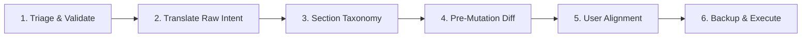
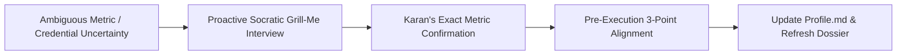

# 👤 Personal Profile & Dossier Skill

Use this skill to inspect, verify, update, or audit Karan Singh Verma's permanent personal profile, biographical metrics, academic credentials, and strategic milestones in `~/.gemini/Profile.md`.

---

## 🎮 Invocation Modes

| Mode / Command | Trigger & Purpose | Protocol |
| :--- | :--- | :--- |
| **Inspect / Query** | `/profile`, `/profile bio`, `/profile academic`, etc. | Direct, read-only factual extraction. Zero edits proposed. |
| **Age / Cutoff Check** | `/profile age`, `/profile age <cutoff_date>` | Executes `scripts/calculate_age.py` for exact Years/Months/Days and exam eligibility. |
| **Mutate / Update** | `/profile update ...`, `/profile add ...` | Triggers the **6-Stage Dossier Lifecycle Pipeline**. |
| **Audit & Verify** | `/profile audit` | Scans for date/age consistency, stale milestones, and formatting integrity. |
| **Rollback** | `/profile rollback` | Restores `~/.gemini/Profile.md` from `~/.gemini/Profile.md.bak`. |

---

## 🏛️ Dossier Management Lifecycle

Every modification to `~/.gemini/Profile.md` must strictly follow this 6-stage operational pipeline:



---

## 📋 Operational Directives

### 1. 🔍 Boundary Filtration & Separation of Concerns
- **Filtration**:
  - `~/.gemini/Profile.md` is strictly for **Human Identity, Biometrics, Credentials, and Milestones**.
  - System directives, AI execution rules, database schemas $\rightarrow$ `~/.gemini/GEMINI.md` (via `/gemini`).
  - Rolling tactical tasks & strikes $\rightarrow$ SQLite (via `/campaign strike`).
  - Ephemeral chat context or scratch notes $\rightarrow$ discarded or stored in session memory.

### 2. 🎯 Intent Translation & Factual Rigor
- **Translate Raw Input**: Cleanly format shorthand notes into structured, tabular or bulleted records.
  - *Example*: `/profile add run 1.6km 7m10s` $\rightarrow$ parses into Section 3 (Physical Metrics PST Matrix).
  - *Example*: `/profile add 10th 84% CBSE 2021` $\rightarrow$ parses into Section 2 (Educational Ledger).
- **Data Integrity**: Never invent, extrapolate, or guess dates, physical measurements, or credential scores. If a parameter is incomplete, record verified values or ask for clarification.
- **Tone**: Strictly factual, objective, 3rd-person profile documentation. Zero conversational filler.

### 3. 🛡️ Deduplication & Conflict Prevention
- **Field-Level Deduplication**: Update existing keys (e.g. weight, current semester) in-place instead of creating duplicate conflicting lines.
- **Historical Tracking**: For metrics that evolve over time (e.g. fitness milestones or semester progression), update the active stat or log an append in a structured timeline format.

### 4. 🗂️ Standard Taxonomy & Category Layout
All entries in `~/.gemini/Profile.md` must adhere to these 5 distinct sections:

1. `🏛️ 1. Core Demographics & Identity`: Full Name, DOB, Age/Calculated baseline, Location, Identity context.
2. `🎓 2. Academic & Certification Baseline`: Qualifications ledger (10th, 12th, Diploma), semester progress, technical certificates.
3. `🏃 3. Physical & Biometric Metrics (PST Standards)`: Height, weight, endurance run times (1.6 km, 5 km), push-ups/pull-ups benchmark matrix.
4. `🛠️ 4. Technical Skill Inventory`: Linux, Python automation, Neovim, terminal environments, tooling.
5. `🎯 5. Strategic Timelines & Runway Constraints`: Hostel runway (June 2027), diploma completion (June 2026), recruitment windows.

### 5. 🪝 Pre-Mutation Audit Summary (Verification Hook)
Before modifying `~/.gemini/Profile.md`, present a clear 4-part breakdown:
- **Target Field / Section**: The exact section being updated.
- **Previous Value**: What was previously recorded (or `None` if new).
- **Proposed Delta**: The new or modified record.
- **Preview**: Formatted markdown snippet.

### 6. 💾 Backup, Auto-Initialization & Strict Formatting Execution
- **Rollback Safety**: Before writing or modifying an existing `~/.gemini/Profile.md`, always create/update `~/.gemini/Profile.md.bak`.
- **Formatting Standards**:
  - Strictly UTF-8 encoded.
  - Standard GitHub Flavored Markdown with clean tables and bullet hierarchies.
  - Standard ISO / DD-MM-YYYY date conventions.

---

## ⏱️ Dynamic Age & Cutoff Engine (`scripts/calculate_age.py`)

When the user runs `/profile age` or `/profile age <date>`:
Execute:
```powershell
python "~/.gemini/antigravity-cli/skills/profile/scripts/calculate_age.py" "<cutoff_date>"
```
This returns exact Years, Months, Days as of that date and checks against all major recruitment age brackets (SSC GD/MTS/CGL, CPO SI, CAPF, PCS/UPSC).

---

## 🔁 Self-Improvement & Socratic `/grill-me` Alignment Loop



1. **Active Socratic Interviewing (`/grill-me`)**:
   - When a biographical metric, score, or date is incomplete or ambiguous, the AI immediately asks sharp, structured clarification questions instead of estimating or extrapolating.
2. **Continuous Dossier Evolution**:
   - Accurately captures new physical standards, academic milestones, and timeline constraints across conversation sessions.

---

## 🧹 Profile Audit Routine (`/profile audit`)

When `/profile audit` is triggered:
1. **Consistency Check**: Verify that dates are logically sequenced (e.g., DOB vs completion milestones).
2. **Completeness Check**: Flag placeholder sections ready for user population.
3. **Format Integrity**: Verify markdown headers, table alignments, and backup presence.


